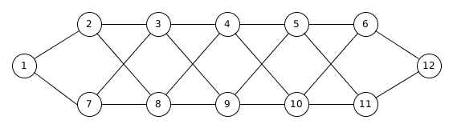

# Multipath

This project focuses on finding two node-disjoint paths that maximize the bandwidth (capacity) between a source and destination in a connected graph, by implementing an algorithm from scientific literature (see multipath.py).  It also provides statistical analysis by using a Monte Carlo simulation.


## Running the simulation
The simulation runs the multipath-finding code for a specified number of iterations, where in each iteration all edges in the graph are assigned a bandwidth value randomly picked from a uniform distribution (currently set in the range 1 to 100). The simulation then evaluates the bandwidth values computed for the iterations statistically and plots a Normalized Frequency Histogram of the computed total bandwidths. Currently the simulation uses a graph with 12 nodes, shown in Figure 1. The graph could be a representation of a network topology of switches, for example.



Figure 1: A 12 node graph


To run the simulation:

```bash
python simulation [number_of_iterations]

#For example, to run a Monte Carlo simulation of 5000 trials, the command will be:
python simulation 5000
```
